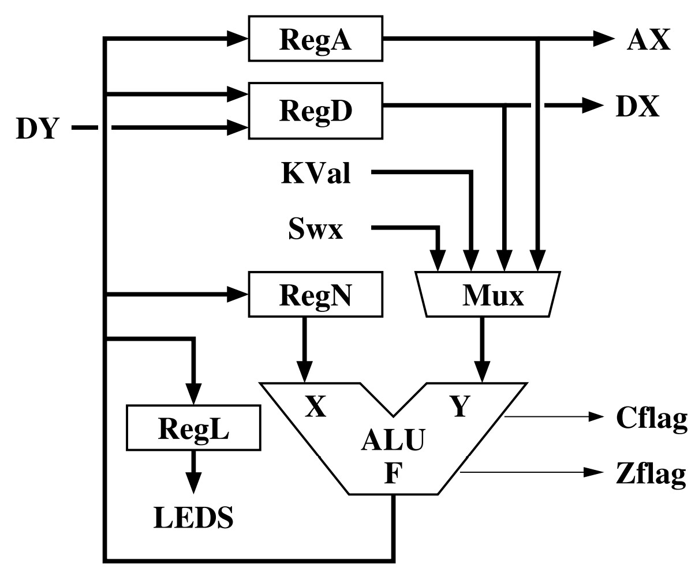
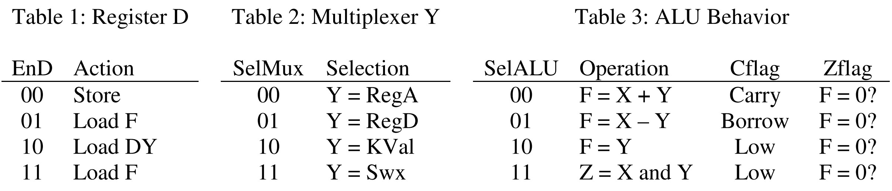
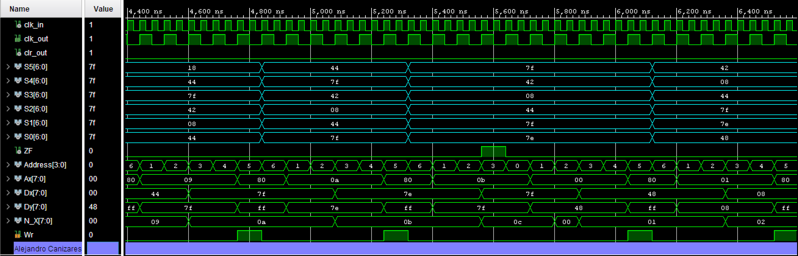

# FPGA Scrolling Display

## Skills and tools used

> VHDL | Intel Altera FPGA | RTL | Test bench development and simulation | Microcode

## Summary
This project utilizes an Altera FPGA to implement a scrolling message display showing the phrase “Happy day - ” through six seven-segment displays. To accomplish this, the project uses a microcode controlled datapath along with peripherals. The peripheral devices consist of a Read-Only-Memory (ROM) containing a series of codes that represent the message to be displayed. The datapath writes to a shift register producing the scrolling message.

## Screenshots

  
   
 

